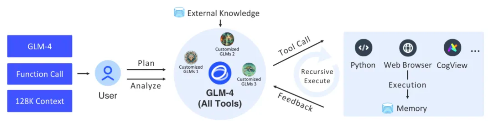

#   🔗 LangChain-ZhipuAI


## 项目介绍
本项目通过langchain的基础组件，实现了完整的支持智能体和相关任务架构。底层采用智谱AI的最新的 `GLM-4 All Tools`, 通过智谱AI的API接口，
能够自主理解用户的意图，规划复杂的指令，并能够调用一个或多个工具（例如网络浏览器、Python解释器和文本到图像模型）以完成复杂的任务。



> 图｜GLM-4 All Tools 和定制 GLMs（智能体）的整体流程。


## 快速使用
- 安装依赖
```shell
pip install langchain-zhipuai -U
```

> 使用前请设置环境变量`ZHIPUAI_API_KEY`，值为智谱AI的API Key。
 

- 代码解析使用示例

### 1. 导入和设置
这部分只是导入所有需要的库和模块，就像在开始修车之前先把所有工具拿出来一样。

```python
import logging
import logging.config
import pytest
from langchain.agents import tool
from langchain.tools.shell import ShellTool
from pydantic.v1 import BaseModel, Extra, Field
from langchain_zhipuai.agent_toolkits import BaseToolOutput
from langchain_zhipuai.agents.zhipuai_all_tools import ZhipuAIAllToolsRunnable
from langchain_zhipuai.agents.zhipuai_all_tools.base import AllToolsAction, AllToolsActionToolEnd, AllToolsActionToolStart, AllToolsFinish, AllToolsLLMStatus
from langchain_zhipuai.callbacks.agent_callback_handler import AgentStatus

```
### 2. 日志配置
这部分设置了日志记录。它配置了日志的去向（控制台和文件）、格式及其他细节，用来跟踪代码的运行情况和任何问题。

```python
logging.config.dictConfig({
    "version": 1,
    "disable_existing_loggers": False,
    "formatters": {
        "formatter": {
            "format": "%(asctime)s %(name)-12s %(process)d %(levelname)-8s %(message)s"
        }
    },
    "filters": {
        "logger_name_filter": {"()": "zhipuai.core.logs.LoggerNameFilter"}
    },
    "handlers": {
        "stream_handler": {
            "class": "logging.StreamHandler",
            "formatter": "formatter",
            "level": "INFO"
        },
        "file_handler": {
            "class": "logging.handlers.RotatingFileHandler",
            "formatter": "formatter",
            "level": "INFO",
            "filename": "logs/local_1719202815677/zhipuai.log",
            "mode": "a",
            "maxBytes": 3221225472,
            "backupCount": 3221225472,
            "encoding": "utf8"
        }
    },
    "loggers": {
        "langchain_zhipuai_core": {
            "handlers": ["stream_handler", "file_handler"],
            "level": "INFO",
            "propagate": False
        }
    },
    "root": {"level": "INFO", "handlers": ["stream_handler", "file_handler"]}
})

```
### 3. 定义一个Shell命令工具
这个装饰器定义了一个工具，用于执行Shell命令。它使用ShellTool来运行命令并返回输出。

```python
@tool
def shell(query: str = Field(description="要执行的命令")):
    """使用Shell执行系统Shell命令"""
    tool = ShellTool()
    return BaseToolOutput(tool.run(tool_input=query))

```

### 4. 创建一个代理执行器
这部分设置了一个执行器来运行多个工具。它使用一个叫glm-4-alltools的模型，并包括之前定义的shell工具。
`sandbox`: 指定代码沙盒环境，默认 = auto，即自动调用沙盒环境执行代码。 设置 sandbox = none，不启用沙盒环境后。
代码生成后返回状态 status = requires_action，需要用户提交代码执行结果。

```python
agent_executor = ZhipuAIAllToolsRunnable.create_agent_executor(
    model_name="glm-4-alltools",
    tools=[{
        "type": "code_interpreter",
        "code_interpreter": {
            "sandbox": 'auto'
        }
    }, shell],
)

```


### 5. 使用代理运行Shell命令并打印结果
这部分使用代理来运行一个Shell命令，并在结果出现时打印出来。它检查结果的类型并打印相关信息。
这个invoke返回一个异步迭代器，可以用来处理代理的输出。
你可以多次调用invoke方法，每次调用都会返回一个新的迭代器。
ZhipuAIAllToolsRunnable会自动处理状态保存和恢复，一些状态信息会被保存实例中
你可以通过callback属性获取intermediate_steps的状态信息。
```python
chat_iterator = agent_executor.invoke(
    chat_input="看下本地文件有哪些，告诉我你用的是什么文件,查看当前目录"
)
async for item in chat_iterator:
    if isinstance(item, AllToolsAction):
        print("AllToolsAction:" + str(item.to_json()))
    elif isinstance(item, AllToolsFinish):
        print("AllToolsFinish:" + str(item.to_json()))
    elif isinstance(item, AllToolsActionToolStart):
        print("AllToolsActionToolStart:" + str(item.to_json()))
    elif isinstance(item, AllToolsActionToolEnd):
        print("AllToolsActionToolEnd:" + str(item.to_json()))
    elif isinstance(item, AllToolsLLMStatus):
        if item.status == AgentStatus.llm_end:
            print("llm_end:" + item.text)
```

## 集成demo
我们提供了一个集成的demo，可以直接运行，查看效果。
- 安装依赖
```shell
fastapi = "~0.109.2"
sse_starlette = "~1.8.2" 
uvicorn = ">=0.27.0.post1"
# webui
streamlit = "1.34.0"
streamlit-option-menu = "0.3.12"
streamlit-antd-components = "0.3.1"
streamlit-chatbox = "1.1.12.post4"
streamlit-modal = "0.1.0"
streamlit-aggrid = "1.0.5"
streamlit-extras = "0.4.2"
```

- 运行后端服务[server.py](tests/assistant/server/server.py)
```shell
python tests/assistant/server/server.py
```

- 运行前端服务[test_chat.py](tests/assistant/test_chat.py)
```shell
python tests/assistant/test_chat.py
```

> 展示
https://github.com/MetaGLM/langchain-zhipuai/assets/16206043/06863f9c-cd03-4a74-b76a-daa315718104
 